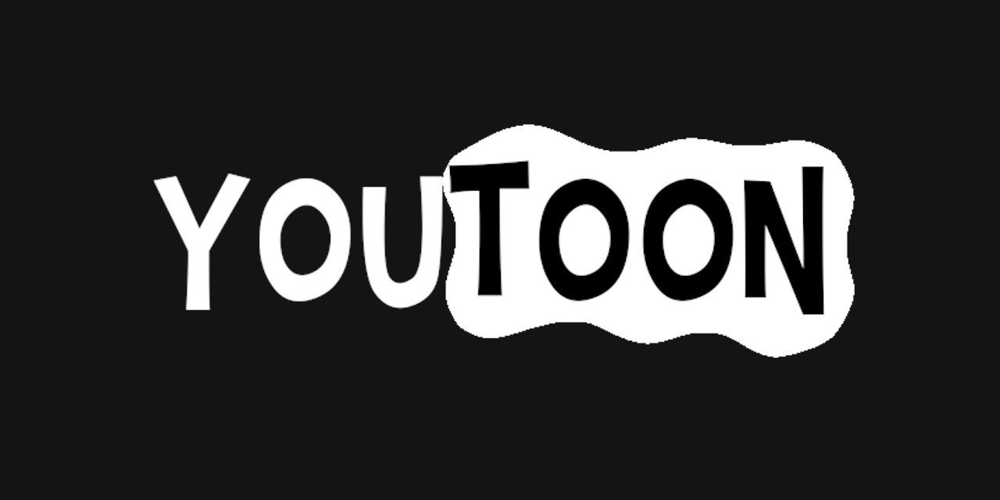

# YouToon - Tiago Alcantara

> 

>Compilado de animações produzidas e oficialmente publicadas no youtube! Fique a vontade para enviar sugestões. Desenvolvido durante a [Imersão React] da Alura.
>
> Ainda em desenvolvimento, mas você pode ver como está ficando clicando [**aqui**](https://youtoon.vercel.app/)

  

